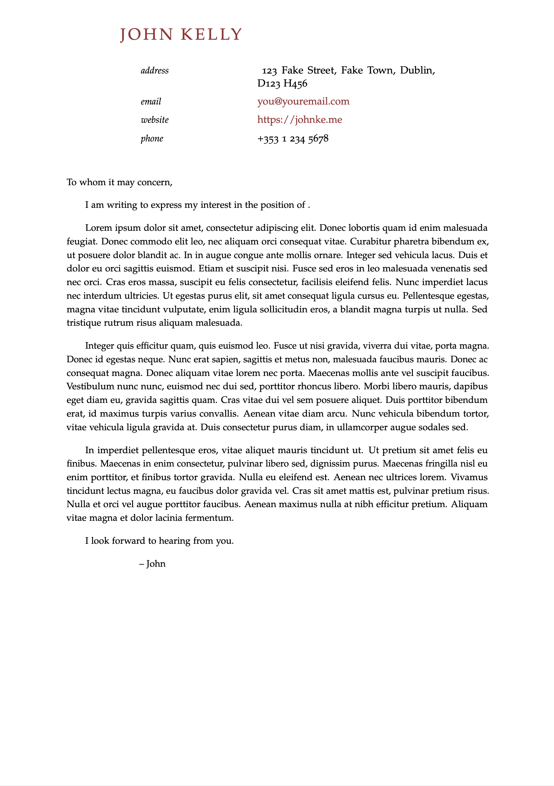

# cv-pandoc

(The worst language in the world) Yaml 🤝 Latex (The second-worst language in the world)

Maybe I'm weird but I personally find YAML to be a totally acceptable place to store my CV. It's just a collection of facts so the semi-structured nature makes sense? But I can't just go sending a YAML file to a recruiter, I need a PDF file. And an easy way from YAML to PDF is through Latex (via Pandoc). And since we've gone this far, why not also just wrap it all together with a Makefile?

And sure since we're at it, why not use this to handle cover letters too?

This is scratching a very sick and twisted personal itch and I don't expect it to be of any use to _anyone else_ (except maybe as a cautionary tale).

## Requirements

- Pandoc
- A working LaTeX installation

## Usage

Update `cv.yaml` with your details. To generate a PDF, run `make cv`.

For cover letters, copy `coverletter_job.md` to `coverletter_<jobname>.md` and update that file using standard markdown. Then run `make coverletter_<jobname>` to generate a PDF. For example, if you have `coverletter_microsoft.md`, then you could run `make coverletter_microsoft`.

## Credits

The styling is based on [Alessandro Plasmati's classicthesis template](https://www.latextemplates.com/template/classicthesis-styled-cv).
